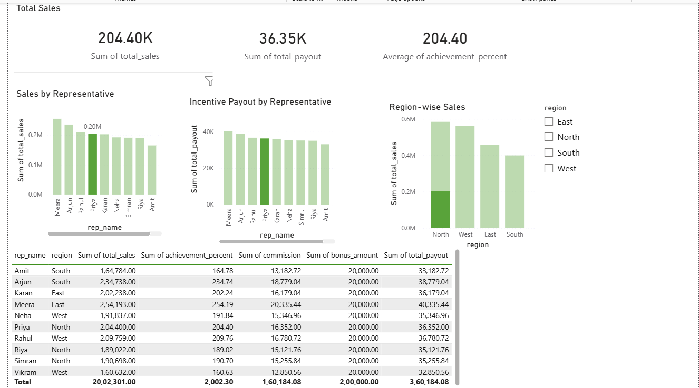

# 🚀 Sales Incentive Compensation Analytics System

## 📊 Dashboard Preview

<p align="center">
  
</p>

---
## 📌 Project Overview

This project simulates a real-world Sales Incentive Compensation system where sales representatives are evaluated based on performance and tier-based commission rules are applied dynamically.

The system is built using:

- **MySQL** – Relational data modeling and rule-based compensation logic  
- **SQL** – Joins, CTEs, aggregation, and tier mapping  
- **Power BI** – Interactive KPI dashboard and performance visualization  

---

## 🎯 Objective

To design a structured compensation framework that:

- Tracks sales performance by representative and region  
- Calculates achievement percentage against predefined targets  
- Applies tier-based commission rules  
- Computes dynamic payout (Commission + Bonus)  
- Visualizes KPIs for business decision-making  

---

## 🏗️ System Architecture

```
MySQL Tables
   ↓
SQL Aggregation + Rule Engine (CTE + Join Mapping)
   ↓
Final Compensation View
   ↓
Power BI Dashboard
```

---

## 🗄️ Database Design

The system consists of three relational tables:

1. **sales_reps** – Representative information and base salary  
2. **sales_transactions** – Transaction-level sales data  
3. **compensation_rules** – Tier-based commission and bonus logic  

A final SQL view (`final_compensation_report`) computes:

- Total Sales  
- Achievement %  
- Commission  
- Bonus  
- Total Payout  

---

## 📊 Dashboard Overview

### 🔹 1️⃣ Overall Performance Dashboard


This dashboard provides:

- Total Sales KPI  
- Total Incentive Payout KPI  
- Average Achievement %  
- Sales by Representative  
- Incentive Payout by Representative  
- Region-wise Sales  
- Detailed Compensation Breakdown Table  
- Interactive Region Filter (Slicer)

---

### 🔹 2️⃣ Region Filter Applied – North


When filtering by **North region**, the dashboard dynamically updates:

- KPIs adjust based on North region sales  
- Only North representatives are displayed  
- Total payout recalculates accordingly  

This demonstrates dynamic filter interaction and business segmentation.

---

### 🔹 3️⃣ Region Filter Applied – East


Filtering by **East region**:

- KPIs update in real time  
- Only East region representatives are shown  
- Commission and bonus calculations remain rule-driven  

This validates that the SQL-based compensation logic integrates seamlessly with Power BI filtering.

---

## 🧠 Compensation Logic

Monthly Sales Target: ₹100,000 per representative  

Achievement % is calculated as:

```
(Total Sales / Target) * 100
```

Commission tiers are applied using SQL rule mapping:

| Achievement % | Commission Rate | Bonus |
|---------------|----------------|-------|
| 0–70%        | 2%             | 0     |
| 70–100%      | 4%             | 5,000 |
| 100–120%     | 5%             | 10,000 |
| 120%+        | 8%             | 20,000 |

Final Payout Formula:

```
Total Payout = (Total Sales × Commission Rate) + Bonus
```

All business logic is implemented at the SQL layer using CTEs and joins.

---

## 🛠️ Tech Stack

- MySQL
- SQL (Joins, CTEs, Aggregations)
- Power BI
- Relational Database Modeling

---

## 📂 Project Structure

```
sales-incentive-compensation-analytics/
│
├── data/
│   ├── sales_reps.csv
│   ├── sales_transactions.csv
│   └── compensation_rules.csv
│
├── sql/
│   ├── schema.sql
│   ├── insert_data.sql
│   └── analysis_queries.sql
│
├── screenshots/
│   ├── dashboard_full.png
│   ├── dashboard_filtered_north.png
│   └── dashboard_filtered_east.png
│
└── README.md
```

---

## 🔍 Key Learnings

- Designing normalized relational database schema  
- Implementing rule-based compensation engines  
- Writing structured SQL queries using CTEs and joins  
- Creating interactive business dashboards  
- Translating data into actionable performance insights  

---

## 📈 Business Value Simulation

This project demonstrates how organizations can:

- Automate compensation calculation  
- Improve transparency in incentive structure  
- Identify top performers and underperformance  
- Support data-driven compensation planning  

---

## 👤 Author

Sohel Sheikh  
